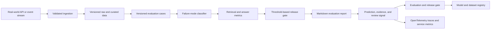

# Architecture

## Problem

RAG systems often ship without a stable regression set or failure taxonomy.

## System Flow

## Components

- **Versioned evaluation cases**
- **Failure-mode classifier**
- **Retrieval and answer metrics**
- **Threshold-based release gate**
- **Markdown evaluation report**

## Recommended Production Stack

- FastAPI for evaluation jobs and reports
- Ragas-style retrieval and faithfulness metrics
- MLflow for experiment and artifact tracking
- PostgreSQL for versioned evaluation cases
- OpenTelemetry plus Phoenix for trace inspection
- GitHub Actions for threshold-based release gates

## Hugging Face Tasks

- `text-classification`
- `question-answering`
- `text-ranking`
- `summarization`

## Model Architecture

The included baseline is a transparent token-prototype model. Training builds
per-label token weights and inverse-document-frequency retrieval weights from
the synthetic training split. The runtime returns a prediction, confidence,
review flag, and evidence documents. This baseline is intentionally small so
it can run in CI without paid compute.

For production, compare it with domain embeddings, gradient-boosted models, or
fine-tuned transformer models using the same held-out evaluation contract.

## Production Boundaries

- Validate and version all input schemas.
- Keep human review for low-confidence or high-impact decisions.
- Store prompts, traces, model versions, and dataset versions together.
- Do not treat synthetic evaluation performance as production evidence.
- Add authentication, authorization, encryption, and retention controls.

## Known Risks

Synthetic cases validate the harness, not a production RAG system. Teams must add representative domain examples.
